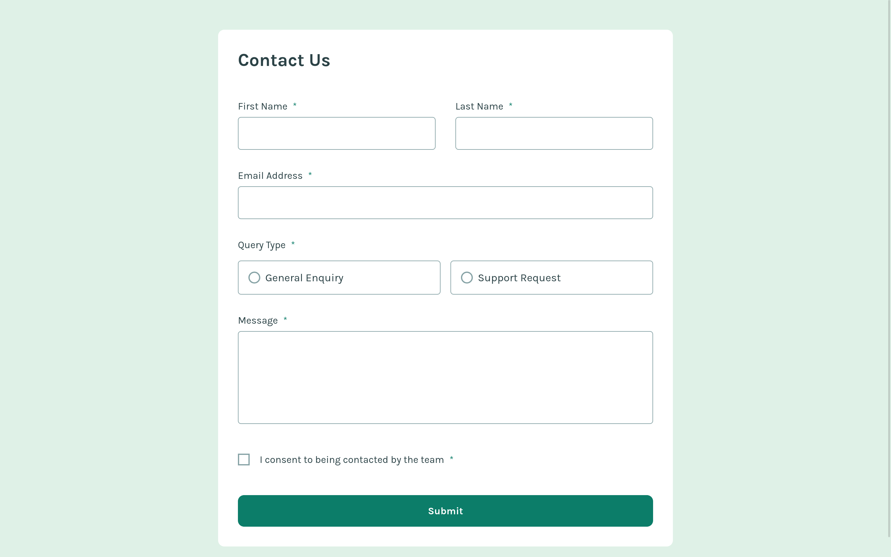
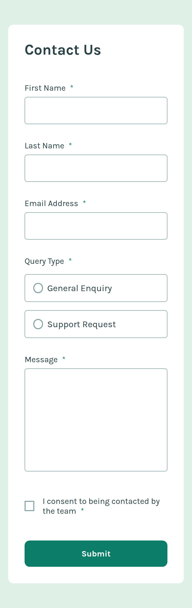

# Frontend Mentor - Contact form solution

This is a solution to the [Contact form challenge on Frontend Mentor](https://www.frontendmentor.io/challenges/contact-form--G-hYlqKJj). Frontend Mentor challenges help you improve your coding skills by building realistic projects. 

## Table of contents

- [Overview](#overview)
  - [The challenge](#the-challenge)
  - [Screenshot](#screenshot)
  - [Links](#links)
- [My process](#my-process)
  - [Built with](#built-with)
  - [What I learned](#what-i-learned)
  - [Continued development](#continued-development)
- [Author](#author)

**Note: Delete this note and update the table of contents based on what sections you keep.**

## Overview

### The challenge

Users should be able to:

- Complete the form and see a success toast message upon successful submission
- Receive form validation messages if:
  - A required field has been missed
  - The email address is not formatted correctly
- Complete the form only using their keyboard
- Have inputs, error messages, and the success message announced on their screen reader
- View the optimal layout for the interface depending on their device's screen size
- See hover and focus states for all interactive elements on the page

### Screenshot

### Links

- [Solution Repo (code)](https://github.com/IbrahimMurad/contact-form)
- [Live Site](https://ibrahimmurad.github.io/contact-form/)

## My process

### Built with

- Semantic HTML5 markup
- CSS custom properties
- Flexbox
- Mobile-first workflow
- Vanilla JavaScript
- Sass
- Accessibility
- Form validation

### What I learned

- I learned how to make a form accessible by using aria attributes.
- I learned how to make a form validation using JavaScript.

### Continued development

- I will continue to learn more about accessibility and how to make my projects more accessible.
- I will continue to learn more about form validation and how to make it more user-friendly.

## Author

- [Email](mailto:ibrahimmorad31@gmail.com)
- [LinkedIn](https://www.linkedin.com/in/ibrahim-morad-228410209/)
- [Frontend Mentor](https://www.frontendmentor.io/profile/IbrahimMurad)
- [Github](https://github.com/ibrahimmurad/)
- [Discord](https://discord.com/users/ibrahimmorad)